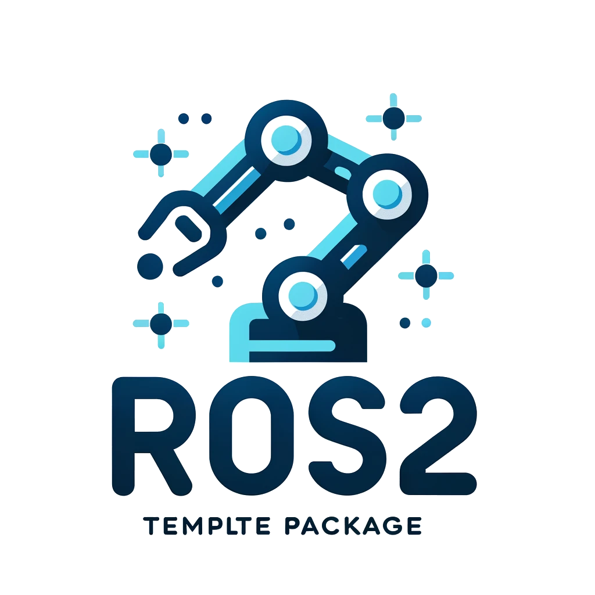

# ROS2 Template C++ Package

This package is was designed as a starting point for building a ROS2 C++ package with:
- automatically configuring cmake file
- pre-defined structures and conventions for namespacing and code structures
- adherence to ROS2 design conventions
- pre-included doxygen configuration with easy to use and stylish output
- pre-defined github actions to build the documentation and deploy it to github.io

## Configuring the package

